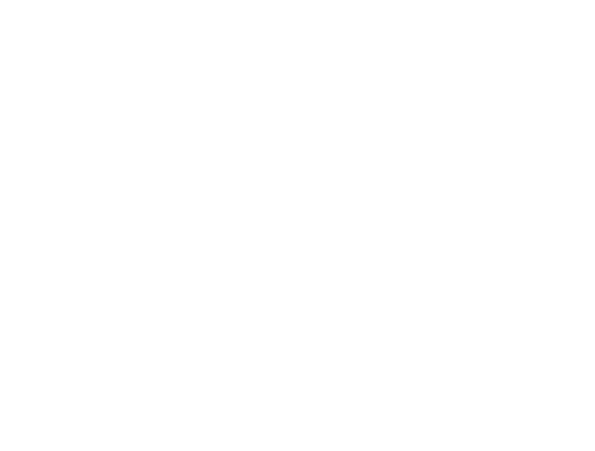
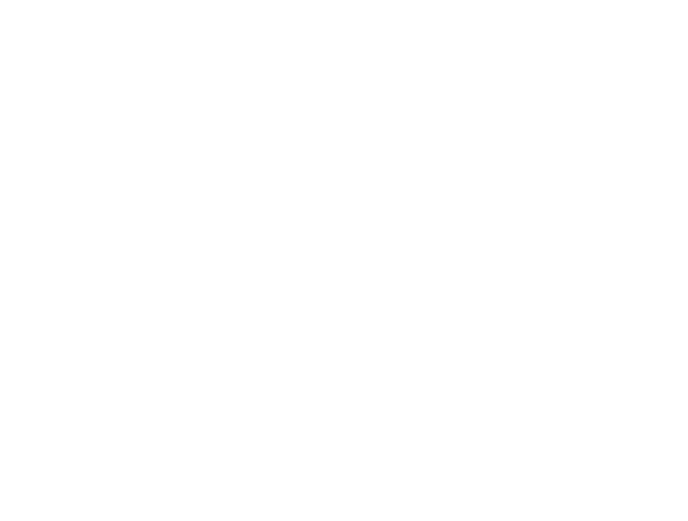
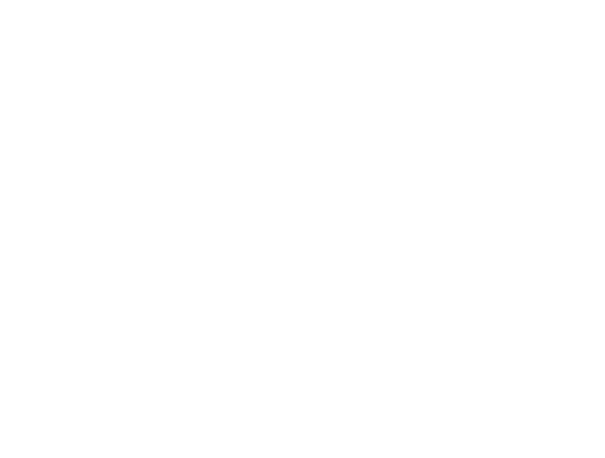
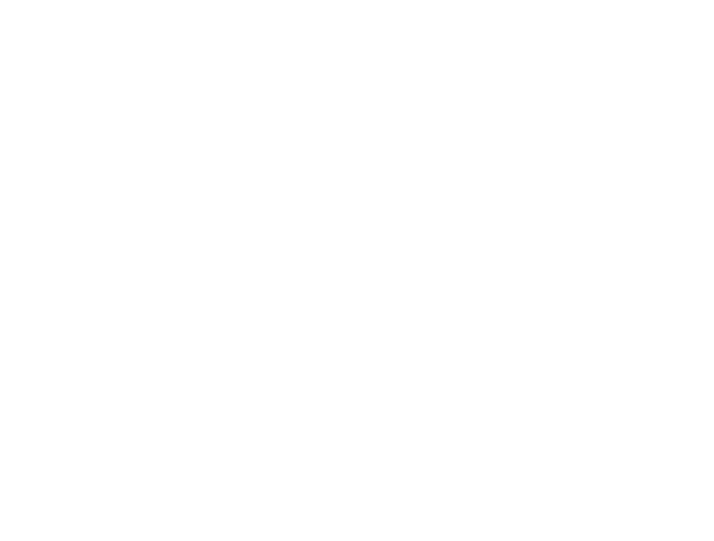
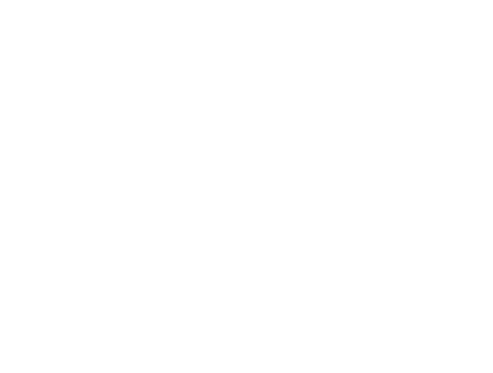

# GutBrainAxis-PD-Microbiome-ML

Machine learning and biological interpretation pipeline for gut-brain axis signals in Parkinson's disease using public shotgun metagenomics data.

## Project Idea

This project asks whether stool metagenomic profiles can distinguish Parkinson's disease from neurologically healthy controls, and which microbial taxa may support a gut-brain axis biological story.

```text
shotgun metagenomics source data
-> species relative abundance matrix
-> compositional feature transformation
-> differential species analysis
-> Parkinson's disease classifier
-> microbial feature importance
-> gut-brain axis mechanism annotation
```

## Dataset

Primary dataset:

| Dataset | Samples | Cases | Controls | Data type |
|---|---:|---:|---:|---|
| Wallen et al. 2022 Parkinson gut metagenomics | 724 | 490 | 234 | shotgun metagenomics |

The workflow uses the processed source-data workbook from Zenodo:

- Zenodo DOI: `10.5281/zenodo.7246185`
- Raw read BioProject: `PRJNA834801`
- Sheets used: `subject_metadata`, `metaphlan_rel_ab`

The raw workbook is downloaded into `data/raw/` and is ignored by Git because it is large.

## Workflow

Run with Bash:

```bash
bash workflows/run_pipeline.sh
```

Run with Nextflow:

```bash
nextflow run main.nf
```

Note: the Bash workflow was used for local verification in this workspace because Nextflow is not currently installed on this machine. The `main.nf` workflow is included for reproducible execution on a Nextflow-enabled system.

## What Each Step Does

`src/00_prepare_data.py`

- downloads the Zenodo source workbook if missing
- reads metadata and MetaPhlAn relative abundance profiles
- keeps PD and control samples
- extracts species-level taxa
- filters low-prevalence taxa
- selects high-variance species features
- applies `log1p(relative abundance * 1,000,000)` transformation

`src/01_differential_taxa.py`

- compares PD vs control abundance for each species
- uses Mann-Whitney U tests
- reports log2 fold-change and FDR
- creates a top differential species figure

`src/02_train_ml.py`

- trains logistic regression, random forest, and extra trees classifiers
- evaluates ROC-AUC, PR-AUC, balanced accuracy, and F1
- saves held-out test metrics, confusion matrix, and feature importance

`src/03_gut_brain_story.py`

- combines differential abundance and ML feature importance
- maps important taxa to gut-brain axis themes
- summarizes SCFA/anti-inflammatory, mucin/barrier, opportunistic/inflammatory, neuroactive metabolism, and oral-gut translocation hypotheses

## Current Results

The real-data run used 724 stool metagenomics samples and 257 filtered species-level MetaPhlAn features.

Cross-validation benchmark:

| Model | ROC-AUC | PR-AUC | Balanced Accuracy | F1 |
|---|---:|---:|---:|---:|
| Extra trees | 0.772 | 0.876 | 0.618 | 0.818 |
| Random forest | 0.756 | 0.870 | 0.678 | 0.797 |
| Logistic regression | 0.679 | 0.810 | 0.636 | 0.737 |

Held-out test performance:

| Model | Accuracy | Balanced Accuracy | F1 | ROC-AUC | PR-AUC | Test samples |
|---|---:|---:|---:|---:|---:|---:|
| Extra trees | 0.710 | 0.603 | 0.809 | 0.833 | 0.923 | 145 |







Differential abundance highlights PD-associated species such as `Actinomyces oris`, `Bifidobacterium dentium`, `Streptococcus mutans`, and `Klebsiella pneumoniae`. The biological interpretation step connects important taxa to gut-brain axis themes including oral-gut translocation, mucin/gut barrier biology, opportunistic inflammation, and neuroactive metabolism.





## GitHub Outputs

Figures:

```text
docs/figures/pd_classifier_benchmark.png
docs/figures/pd_confusion_matrix.png
docs/figures/ml_taxa_importance.png
docs/figures/differential_species_log2fc.png
docs/figures/gut_brain_mechanism_summary.png
```

Tables:

```text
docs/tables/dataset_manifest.csv
docs/tables/pd_classifier_benchmark.csv
docs/tables/pd_heldout_metrics.csv
docs/tables/top_differential_species.csv
docs/tables/top_ml_taxa_importance.csv
docs/tables/gut_brain_axis_taxa_story.csv
```

## Biological Story

Parkinson's disease has strong gastrointestinal involvement, including constipation and altered gut physiology. This project treats the gut microbiome as a measurable molecular phenotype of the gut-brain axis.

The analysis looks for microbial taxa that are both:

- statistically shifted between PD and controls
- useful for ML classification

Those taxa are then interpreted through gut-brain axis mechanisms such as inflammation, gut barrier integrity, short-chain fatty acid production, neuroactive metabolism, and oral-gut microbial translocation.

## References

- Wallen et al. 2022, Nature Communications: https://www.nature.com/articles/s41467-022-34667-x
- Zenodo source data: https://zenodo.org/records/7246185
- NCBI BioProject: https://www.ncbi.nlm.nih.gov/bioproject/834801
- MetaPhlAn: https://huttenhower.sph.harvard.edu/metaphlan/
- scikit-learn: https://scikit-learn.org/

This project is for research and education only.
